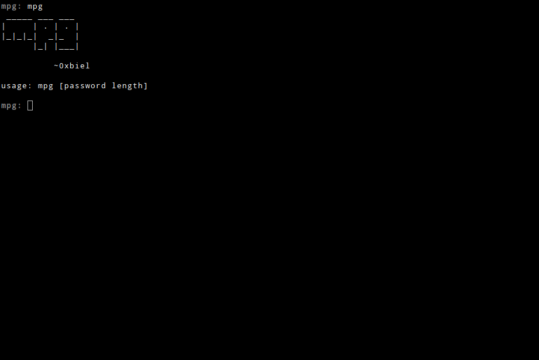
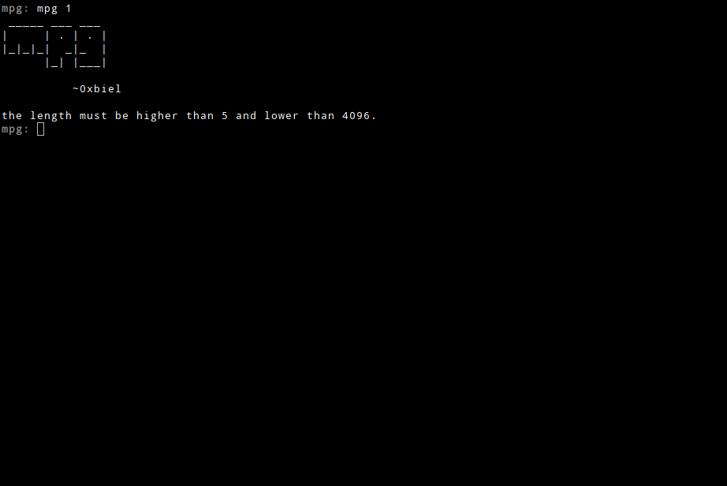
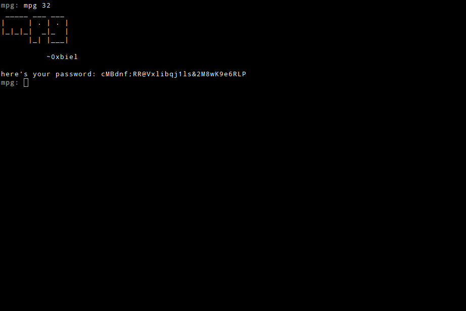

<h1 align="center">mpg - minimal password generator.</h1>

   
  <i>if first argument isn't provided, help is shown.</i>
   
  <i>if length is too small or too big, this warning is shown.</i>
   
  <i>working right!</i>

## Dependecies

NONE!

## Usage

`mpg [lenght]`

easy, right?

## License

Copyright (C) 2020  Biel A. P.

This program is free software: you can redistribute it and/or modify it under the terms of the GNU General Public License version 3, as published
by the Free Software Foundation.

This program is distributed in the hope that it will be useful, but WITHOUT ANY WARRANTY; without even the implied warranties of MERCHANTABILITY, SATISFACTORY QUALITY, or FITNESS FOR A PARTICULAR PURPOSE.  See the GNU General Public License for more details.
